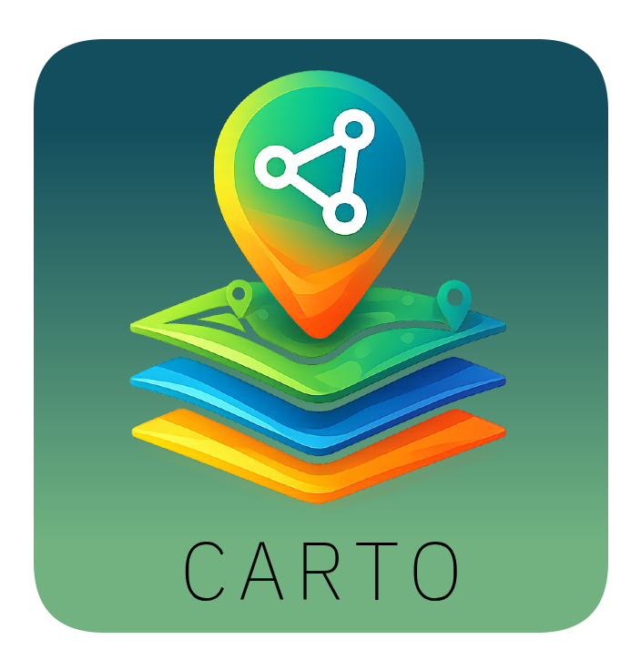

<div align="center">
  

  <h1>Carto</h1>
  <p><strong>Web-first Zenoh traffic inspector with desktop builds for Windows, macOS, and Linux</strong></p>
  <p>Inspect, filter, decode, and publish Zenoh messages in real time.</p>

  <p>
    <a href="LICENSE">
      
    </a>
    
    <a href="https://github.com/derek-diaz/Carto/releases">
      
    </a>
  </p>
</div>

Carto is an open-source, web-first app for Zenoh observability and debugging. It connects to a Zenoh router through the Remote API WebSocket endpoint, subscribes to key expressions, streams live traffic, and helps you inspect payloads quickly. Desktop packages are still produced for Windows, macOS, and Linux.

The name "Carto" comes from "cartografo" (Spanish for mapmaker).

## Table of Contents

- [Features](#features)
- [Screenshots](#screenshots)
- [Installation](#installation)
- [Zenoh Router Requirements](#zenoh-router-requirements)
- [Run Carto in Docker](#run-carto-in-docker)
- [Zenoh Router Docker](#zenoh-router-docker)
- [Development](#development)
- [Load Testing](#load-testing)
- [Packaging](#packaging)
- [Roadmap](#roadmap)
- [Keywords](#keywords)

## Features

- Live Zenoh stream monitoring by key expression
- Multi-subscription workflow with pause, clear, and unsubscribe controls
- Stream filtering by key and message content
- Message drawer with decoded views for JSON, text, and binary payloads
- Protobuf schema loading and Protobuf decode support in stream view
- Publish messages with `json`, `text`, `base64`, and `protobuf` modes
- Recent key explorer and key-expression history for subscribe/publish flows
- Connection status, logs, and app-level diagnostics
- Settings import/export for sharing local profiles and schema setup
- Light and dark themes for long monitoring sessions

## Screenshots

### Dark mode stream view

<p align="center">
  
</p>

### Light mode stream view

<p align="center">
  
</p>

### Publish workflow

<p align="center">
  
</p>

## Installation

Prebuilt installers for Windows, macOS, and Linux are available on the
[Releases page](https://github.com/derek-diaz/Carto/releases).

## Zenoh Router Requirements

Carto requires a Zenoh router with `zenoh-plugin-remote-api` enabled.

- Enable `zenoh-plugin-remote-api` on your router
- Ensure the Remote API WebSocket endpoint is reachable (default `ws://127.0.0.1:10000/`)
- REST is often exposed at `http://127.0.0.1:8000/`, but Carto uses WebSocket

Useful links:

- [zenoh-plugin-remote-api downloads](https://download.eclipse.org/zenoh/zenoh-plugin-remote-api/)
- [Adding plugins and backends to the Zenoh container](https://zenoh.io/docs/getting-started/quick-test/#adding-plugins-and-backends-to-the-container)

## Run Carto in Docker

Pull the published image:

```bash
docker pull tabierto/carto:latest
```

Run it:

```bash
docker run --rm -p 8080:8080 tabierto/carto
```

Then open:

```text
http://localhost:8080
```
If your Zenoh router is running on the same machine as Docker, you can use the normal local endpoint:

```text
ws://127.0.0.1:10000/
```

Carto rewrites loopback addresses inside the container to the Docker host automatically. Direct non-loopback IPs also work as long as they are reachable from the container network.

## Zenoh Router Docker

This repository includes a local Docker setup for Zenoh + Remote API:

```bash
cd docker
docker compose up --build
```

Default endpoint:

```text
ws://localhost:10000
```

See `docker/README.md` for Docker-specific details.

## Development

Requirements:

- Node.js 24+ for desktop builds
- Node.js for the default web server runtime
- Bun optional for experimentation

Run locally:

```bash
npm install
npm run dev:desktop
```

Run the web frontend locally:

```bash
npm run build:web
npm run dev:web
```

Run the web/server mode locally:

```bash
npm install
npm run build:server
npm run start:web
```

Experimental Bun server run:

```bash
bun install
npm run start:web:bun
```

## Load Testing

Carto includes a local Zenoh load publisher for reproducing large-payload issues.

Default run:

```bash
npm run load:test -- --endpoint ws://127.0.0.1:10000/
```

That sends 100 messages to `carto/load-test` in bursts of 5, with payload sizes randomized between 600 KiB and 900 KiB.

Example heavier run:

```bash
npm run load:test -- --endpoint ws://127.0.0.1:10000/ --count 200 --burst 10 --pause-ms 50 --min-kib 600 --max-kib 900
```

Useful flags:

- `--keyexpr` to isolate the test stream
- `--format json|text` to switch payload shape
- `--count` to control total messages
- `--burst` and `--pause-ms` to shape the send rate

## Packaging

Build all supported desktop targets locally:

```bash
npm run dist
```

Build per platform:

```bash
npm run dist:mac
npm run dist:win
npm run dist:linux
```

Desktop release automation remains in GitHub Actions via Electron/electron-builder while the app runtime moves toward a web-first architecture.

## Keywords

Zenoh, Eclipse Zenoh, Zenoh inspector, Zenoh monitoring, Zenoh debugging tool, Zenoh desktop client, pub/sub observability, message stream viewer, key expression explorer, Electron Zenoh app, TypeScript desktop app

Made in Puerto Rico. 🇵🇷
