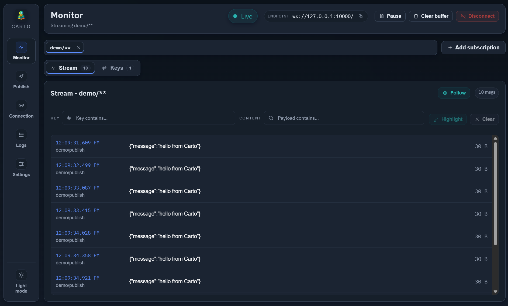
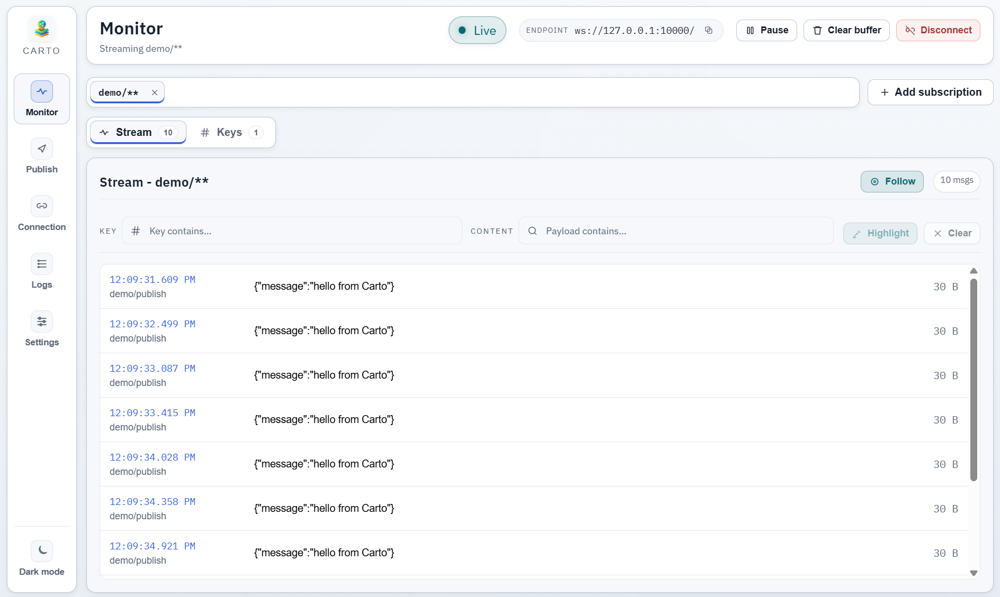
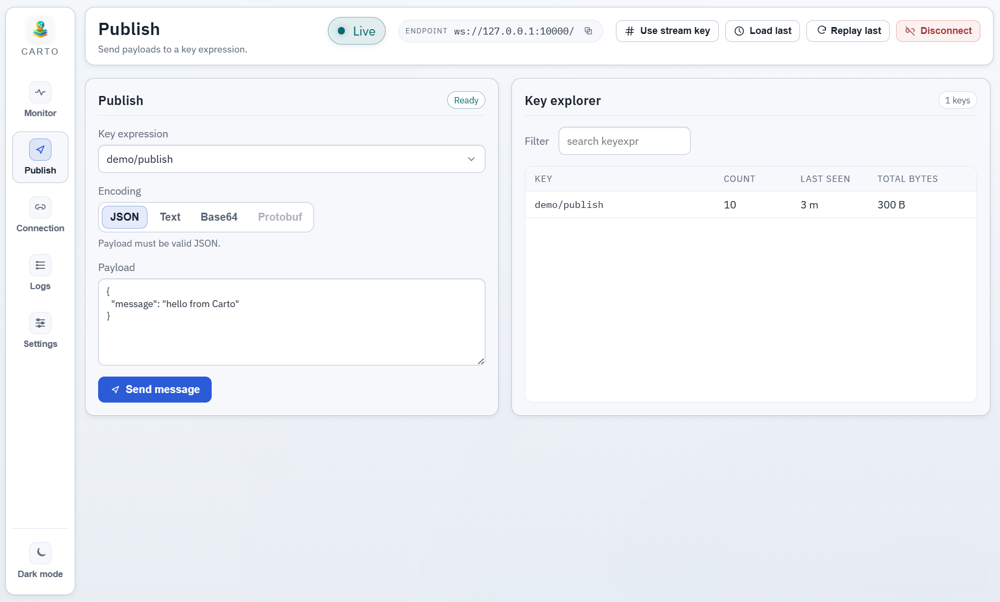

<div align="center">
  

  <h1>Carto</h1>
  <p><strong>Desktop Zenoh traffic inspector for Windows, macOS, and Linux</strong></p>
  <p>Inspect, filter, decode, and publish Zenoh messages in real time.</p>

  <p>
    <a href="https://github.com/derek-diaz/Carto/releases">
      
    </a>
    <a href="LICENSE">
      
    </a>
    
    <a href="https://github.com/derek-diaz/Carto/releases">
      
    </a>
  </p>
</div>

Carto is an open-source desktop app for Zenoh observability and debugging. It connects to a Zenoh router through the Remote API WebSocket endpoint, subscribes to key expressions, streams live traffic, and helps you inspect payloads quickly.

The name "Carto" comes from "cartografo" (Spanish for mapmaker).

## Table of Contents

- [Features](#features)
- [Screenshots](#screenshots)
- [Installation](#installation)
- [Zenoh Router Requirements](#zenoh-router-requirements)
- [Quick Start with Docker](#quick-start-with-docker)
- [Development](#development)
- [Packaging](#packaging)
- [Roadmap](#roadmap)
- [Keywords](#keywords)

## Features

- Live Zenoh stream monitoring by key expression
- Multi-subscription workflow with pause, clear, and unsubscribe controls
- Stream filtering by key and message content
- Message drawer with decoded views for JSON, text, and binary payloads
- Protobuf schema loading and Protobuf decode support in stream view
- Publish messages with `json`, `text`, `base64`, and `protobuf` modes
- Recent key explorer and key-expression history for subscribe/publish flows
- Connection status, logs, and app-level diagnostics
- Settings import/export for sharing local profiles and schema setup
- Light and dark themes for long monitoring sessions

## Screenshots

### Dark mode stream view

<p align="center">
  
</p>

### Light mode stream view

<p align="center">
  
</p>

### Publish workflow

<p align="center">
  
</p>

## Installation

Prebuilt installers for Windows, macOS, and Linux are available on the
[Releases page](https://github.com/derek-diaz/Carto/releases).

## Zenoh Router Requirements

Carto requires a Zenoh router with `zenoh-plugin-remote-api` enabled.

- Enable `zenoh-plugin-remote-api` on your router
- Ensure the Remote API WebSocket endpoint is reachable (default `ws://127.0.0.1:10000/`)
- REST is often exposed at `http://127.0.0.1:8000/`, but Carto uses WebSocket

Useful links:

- [zenoh-plugin-remote-api downloads](https://download.eclipse.org/zenoh/zenoh-plugin-remote-api/)
- [Adding plugins and backends to the Zenoh container](https://zenoh.io/docs/getting-started/quick-test/#adding-plugins-and-backends-to-the-container)

## Quick Start with Docker

This repository includes a local Docker setup for Zenoh + Remote API:

```bash
cd docker
docker compose up --build
```

Default endpoint:

```text
ws://localhost:10000
```

See `docker/README.md` for Docker-specific details.

## Development

Requirements:

- Node.js 24+

Run locally:

```bash
npm install
npm run dev
```

## Packaging

Build all supported targets locally:

```bash
npm run dist
```

Build per platform:

```bash
npm run dist:mac
npm run dist:win
npm run dist:linux
```

## Keywords

Zenoh, Eclipse Zenoh, Zenoh inspector, Zenoh monitoring, Zenoh debugging tool, Zenoh desktop client, pub/sub observability, message stream viewer, key expression explorer, Electron Zenoh app, TypeScript desktop app
