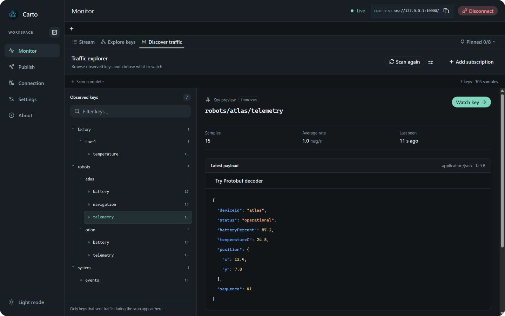
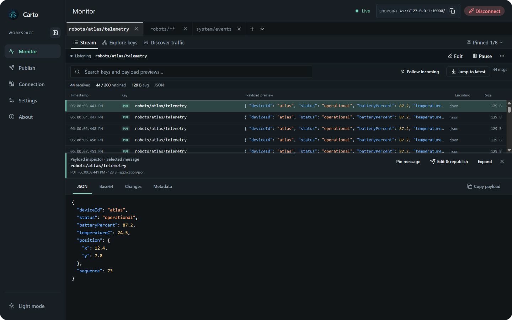
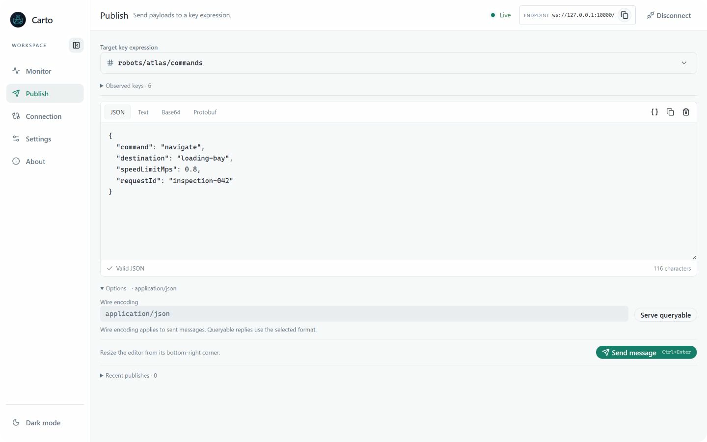

<div align="center">
  
  <h1>Carto</h1>
  <p><strong>See what your Zenoh system is doing.</strong></p>
  <p>Discover active keys. Inspect messages. Decode payloads. Publish with confidence.</p>
  <p>
    <a href="https://github.com/derek-diaz/Carto/releases">Download</a> ·
    <a href="#get-started">Get started</a> ·
    <a href="#documentation">Documentation</a> ·
    <a href="https://github.com/derek-diaz/Carto/issues">Report an issue</a>
  </p>
</div>

Carto is a visual inspector for **Zenoh**. It brings live traffic, key expressions, payload decoding, and publishing into one workspace, so debugging takes fewer logs, command-line tools, and temporary scripts.

Use it as a desktop app on **Windows, macOS, or Linux**, or run it in your browser with Carto’s local web server.

<p align="center">
  
</p>

_Screenshots show Carto 0.9.0 with generated demo traffic._

## Get started

### 1. Open Carto

Download a desktop build from [Releases](https://github.com/derek-diaz/Carto/releases), or [run from source](#run-from-source).

Prefer a browser? See the [web and Docker guide](docs/running-web.md).

### 2. Connect your router

Your Zenoh router needs the **Remote API plugin** (`zenoh-plugin-remote-api`). Enter its WebSocket address in Carto and click **Connect**.

For a local router, the default is:

```text
ws://127.0.0.1:10000/
```

Use the Remote API WebSocket endpoint, rather than the router’s REST address or native Zenoh TCP port.

Need a local router? From this repository, run:

```bash
docker compose -f docker/compose.yml up --build
```

See the [router setup guide](docker/README.md) for details.

### 3. Choose what to watch

Carto starts a **15-second discovery scan** when you connect. Select an observed key to preview its payload, then click **Watch key** to follow incoming messages.

Already know the key expression? Use **Add subscription**. For example, `robots/**` watches matching traffic under `robots/`.

Discovery shows keys that send traffic during the scan. Quiet or inaccessible keys may not appear. Use **Scan again** when needed.

## Inspect messages

Switch between subscriptions using the tabs above the stream. Select a message to inspect its payload, timestamp, size, and encoding, then drag the divider to give the inspector more room. JSON is formatted and color-highlighted; binary data is available as Base64.

- **Filter** the stream by key or payload preview.
- **Changes** compares a message with an earlier message on the same key.
- **Pin message** keeps a payload as a reference for the current app session.
- **Edit & republish** opens an editable draft so you can review it before sending.

<p align="center">
  
</p>

The live buffer is bounded. Pausing freezes the display while newer samples continue to arrive; older payloads can expire. Pin the evidence you need to keep. [Learn about capture limits](docs/usage.md).

## Bring your Protobuf definitions

Load your payload’s `.proto` file **along with its common definitions**. You can select multiple files, drag them in, or paste definitions.

1. Open the message-type picker in a discovered payload and choose **Add schema files…**, or use **Settings → Protobuf schemas → Add schemas**.
2. Add the payload schema and any shared `.proto` files it needs.
3. Choose the payload’s top-level message type to preview the decoded fields. Use **Watch with decoder** to keep that decoder when subscribing.

Shared messages and enums resolve across loaded files automatically. Saved schemas are available the next time you open Carto. A successful decode alone does not prove that the selected type matches the payload.

## Publish from the same workspace

Choose a target key, write a payload, and click **Send message**. Carto supports **JSON, Text, Base64, and Protobuf**, with JSON validation and a formatting action in the editor toolbar.

Type a target or expand **Observed keys** to choose one. Each format keeps its own draft, and the editor resizes to fit your work. Send with **Ctrl+Enter** on Windows/Linux or **Cmd+Enter** on macOS.

**Recent publishes** restores a sent message as a draft without sending it again. **Options** contains custom wire encoding and queryable setup, which lets Carto reply to queries with a payload.

<p align="center">
  
</p>

## Make it your workspace

Switch between light and dark themes, collapse the sidebar for more room, and save connection profiles. Import or export settings to share your schema setup and connection profiles with teammates.

## Run from source

Install **Node.js 24 or newer**, then:

```bash
git clone https://github.com/derek-diaz/Carto.git
cd Carto
npm ci
npm run dev:desktop
```

The first desktop launch may download Electron. If the runtime is missing, run `npm run setup:desktop` and try again. You still need a reachable Zenoh Remote API endpoint to inspect live traffic.

Built with **Electron, React 19, shadcn/ui Rhea, Base UI, Tailwind CSS, and TanStack**. See the [development guide](docs/development.md) for builds, checks, architecture, and packaging.

## Documentation

| I want to…                                         | Start here                                         |
| -------------------------------------------------- | -------------------------------------------------- |
| Understand discovery, decoding, and capture limits | [Using Carto](docs/usage.md)                       |
| Run Carto in a browser or Docker                   | [Web and Docker guide](docs/running-web.md)        |
| Start a local Zenoh router                         | [Router setup](docker/README.md)                   |
| Generate demo traffic                              | [Scenario pack](docs/development.md#scenario-pack) |
| Reproduce high-volume traffic                      | [Load testing](docs/development.md#load-testing)   |
| Develop or package Carto                           | [Development guide](docs/development.md)           |

## License

[Apache License 2.0](LICENSE). Contributions and [feedback](https://github.com/derek-diaz/Carto/issues) are welcome.

Made in Puerto Rico. 🇵🇷
